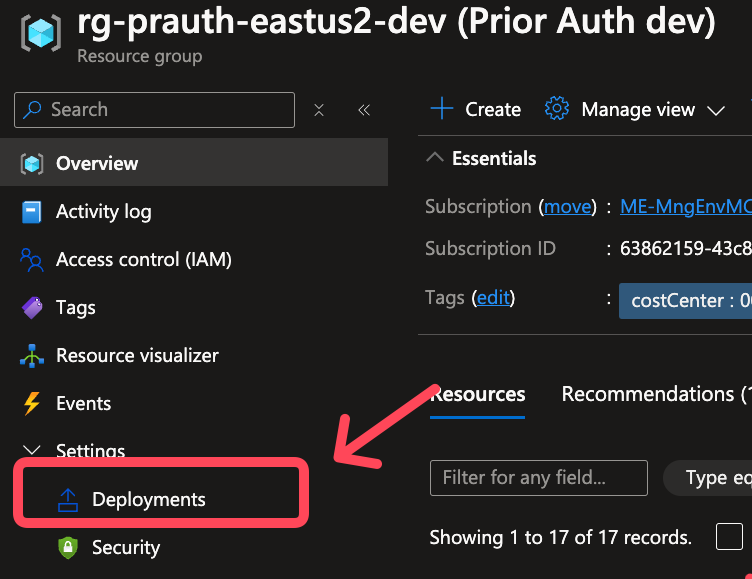
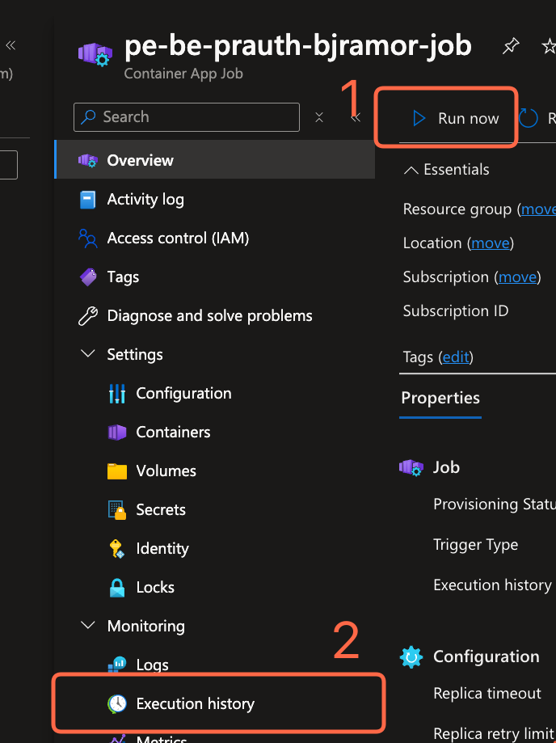
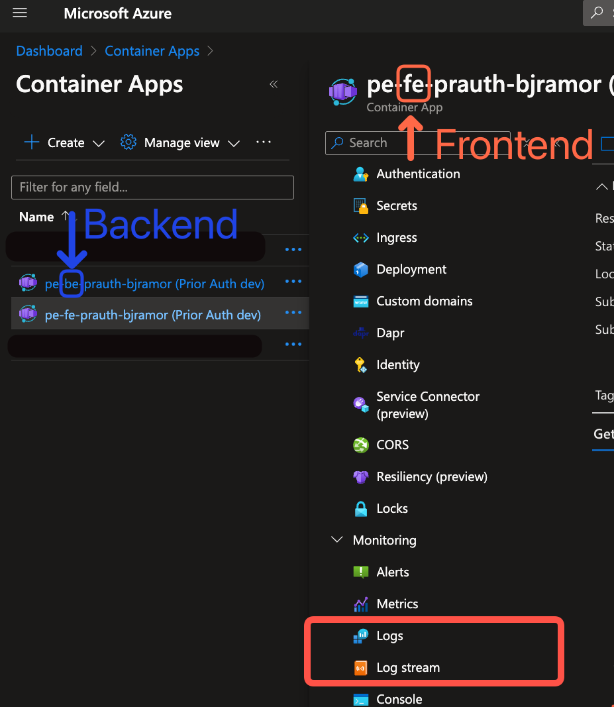
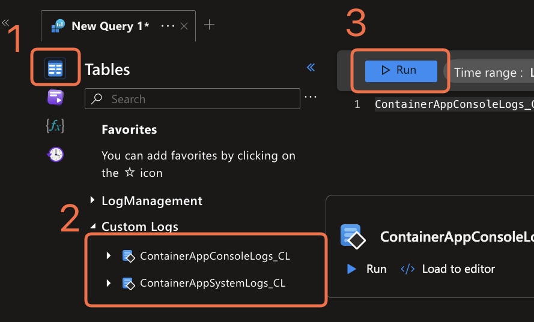

# End-to-End Deployment using Azure Developer CLI

## Table of Contents

1. [Prerequisites](#prerequisites)
2. [Deployment Steps](#deployment-steps)
3. [Common Issues](#common-issues)
4. [Customizing or Configuring AZD Deployments](#customizing-or-configuring-azd-deployments)
5. [CI/CD with Azure Developer CLI (azd)](#cicd-with-azure-developer-cli-azd)
6. [Required Secrets for Federated Workload Identities](#required-secrets-for-federated-workload-identities)
7. [Verify Deployment](#verify-deployment)
8. [Troubleshooting](#troubleshooting)

This guide covers how to deploy the project end-to-end with Azure Developer CLI (azd).

## Prerequisites

1. **Azure Role Permissions (Subscription Scope)**
    - You need `Contributor` to provision resources.
    - You need `User Access Administrator` to assign roles to managed identities.

2. **Install Azure Developer CLI**
    - Follow the [installation guide](https://learn.microsoft.com/azure/developer/azure-developer-cli/install-azd).

3. **Initialize Environment**
    - Run `azd init` to prepare your environment.
        -  Be sure to select "Use code in the current directory"

## Deployment Steps

1. **Adjust Infra Config [Optional]**
  - You can use the variables provided in the defaults in [infra/main.parameters.json](https://github.com/pablosalvador10/gbb-ai-hls-factory-prior-auth/blob/main/infra/main.parameters.json), or you can choose to provide your own desired values.

    <details>
      <summary><strong style="color: blue; cursor: pointer;">Main Deployment Parameters (main.bicep)</strong></summary>
      <table>
        <thead>
          <tr>
            <th>Parameter name</th>
            <th>Required</th>
            <th>Description</th>
            <th>Example</th>
          </tr>
        </thead>
        <tbody>
          <tr>
            <td>environmentName</td>
            <td>Yes</td>
            <td>Name of the environment that can be used as part of naming resource convention</td>
            <td><code>dev</code></td>
          </tr>
          <tr>
            <td>location</td>
            <td>Yes</td>
            <td>Primary location for all resources. Not all regions are supported due to OpenAI limitations</td>
            <td><code>eastus</code></td>
          </tr>
          <tr>
            <td>frontendExists</td>
            <td>No</td>
            <td>Flag to indicate if Frontend app image exists. This is managed by AZD</td>
            <td><code>false</code></td>
          </tr>
          <tr>
            <td>backendExists</td>
            <td>No</td>
            <td>Flag to indicate if Backend app image exists. This is managed by AZD</td>
            <td><code>false</code></td>
          </tr>
          <tr>
            <td>priorAuthName</td>
            <td>No</td>
            <td>Name for the PriorAuth resource and used to derive the name of dependent resources.</td>
            <td><code>priorAuth</code></td>
          </tr>
          <tr>
            <td>tags</td>
            <td>No</td>
            <td>Tags to be applied to all resources</td>
            <td><code>{ environment: 'dev', location: 'eastus' }</code></td>
          </tr>
          <tr>
            <td>openAiApiVersion</td>
            <td>No</td>
            <td>API Version of the OpenAI API</td>
            <td><code>2024-08-01-preview</code></td>
          </tr>
          <tr>
            <td>chatCompletionModels</td>
            <td>No</td>
            <td>List of completion models to be deployed to the OpenAI account.</td>
            <td><code>[ { name: 'o1', version: '2024-12-17', skuName: 'Standard', capacity: 100 } ]</code></td>
          </tr>
          <tr>
            <td>embeddingModel</td>
            <td>No</td>
            <td>List of embedding models to be deployed to the OpenAI account.</td>
            <td><code>{ name: 'text-embedding-3-large', version: '1', skuName: 'Standard', capacity: 50 }</code></td>
          </tr>
          <tr>
            <td>embeddingModelDimension</td>
            <td>No</td>
            <td>Embedding model size for the OpenAI Embedding deployment</td>
            <td><code>3072</code></td>
          </tr>
          <tr>
            <td>storageBlobContainerName</td>
            <td>No</td>
            <td>Storage Blob Container name to land the files for Prior Auth</td>
            <td><code>default</code></td>
          </tr>
        </tbody>
      </table>
    </details>

    > **Note:** If you don't have access to the `o1` model yet, try using the `gpt-4o` configuration for the `chatCompletionModels`
     ```json
        "chatCompletionModels": {
          "value": [
            {
              "name": "gpt-4o",
              "version": "2024-08-06",
              "skuName": "Standard",
              "capacity": 100
            }
          ]
        }
      ```
1. **Deploy**
    - Use `azd up` to provision and deploy.
    - If you want to deploy only a specific service, use `azd deploy <service>` (e.g., `azd deploy frontend`).
    - This provisions defined resources in [infra/main.bicep](https://github.com/pablosalvador10/gbb-ai-hls-factory-prior-auth/blob/main/infra/main.bicep) and deploys services defined in [azure.yaml](https://github.com/pablosalvador10/gbb-ai-hls-factory-prior-auth/blob/main/azure.yaml#L6), generating a `.env` file for local development.

1. **Verify Deployment**
    - Run `azd show` to confirm resources and endpoints.

## Customizing or Configuring AZD Deployments

- **Workflow Definition**
  - [azure.yaml](./azure.yaml): Controls azd behavior, hooks, infrastructure definition, and app deployment.
- **Pre/Post Scripts**
  - [utils/azd/hooks](./utils/azd/hooks/): Holds scripts (e.g., `postprovision`) that update `.env`.
- **Infrastructure**
  - [infra/main.bicep](infra/main.bicep): Main entry point for infrastructure provisioning.
  - [infra/resources.bicep](infra/resources.bicep): Core deployment resources.
  - [infra/main.parameters.json](infra/main.parameters.json): Default deployment values, overrideable by ENV vars.
  - Use `azd provision` to only provision infrastructure.
- **Application Definitions**
  - Apps map to provisioned resources via tags, referencing service names in [azure.yaml](./azure.yaml).
  - For testing only the application layer, use `azd deploy <service>`.

### CI/CD with Azure Developer CLI (azd)

You can automate deployment with azd-generated pipelines.

1. **Create a Pipeline**
    - Run `azd pipeline config` to generate pipeline files for GitHub Actions.
2. **Use Existing Pipelines**
    - Reference [.github/workflows/azd_deploy.yml](https://github.com/pablosalvador10/gbb-ai-hls-factory-prior-auth/blob/main/.github/workflows/azd_deploy.yml) for GitHub Actions.

### Required Secrets for Federated Workload Identities

Refer to [Azure GitHub OIDC docs](https://learn.microsoft.com/azure/developer/github/connect-from-azure-openid-connect) for creating these values.

Add these secrets and variables to your GitHub repository under "Secrets and variables" → "Actions":

#### Secrets
- `AZURE_CLIENT_ID`: Client ID of your Service Principal/Managed Identity (e.g., `00000000-0000-0000-0000-000000000000`)
- `AZURE_TENANT_ID`: Your Azure Tenant ID (e.g., `00000000-0000-0000-0000-000000000000`)
- `AZURE_SUBSCRIPTION_ID`: Your Azure Subscription ID (e.g., `00000000-0000-0000-0000-000000000000`)

#### Variables
- `AZURE_ENV_NAME`: Specifies the Azure Developer CLI environment name (e.g `dev`)
- `AZURE_LOCATION`: Specifies the Azure region to deploy to (e.g `eastus2`)

```yaml
name: Azure Developer CLI Deploy

on:
  push:
     branches:
        - main

jobs:
  build:
     runs-on: ubuntu-latest
     env:
        AZURE_CLIENT_ID: "${{ secrets.AZURE_CLIENT_ID }}"
        AZURE_TENANT_ID: "${{ secrets.AZURE_TENANT_ID }}"
        AZURE_SUBSCRIPTION_ID: "${{ secrets.AZURE_SUBSCRIPTION_ID }}"
        AZURE_ENV_NAME: "${{ vars.AZURE_ENV_NAME }}"
        AZURE_LOCATION: "${{ vars.AZURE_LOCATION }}"
     steps:
        - name: Checkout
          uses: actions/checkout@v4
        - name: Install azd
          uses: Azure/setup-azd@v1.0.0
        - name: Log in with Azure (Federated Credentials)
          run: |
             azd auth login `
                --client-id "$Env:AZURE_CLIENT_ID" `
                --federated-credential-provider "github" `
                --tenant-id "$Env:AZURE_TENANT_ID"
          shell: pwsh
        - name: Provision Infrastructure
          id: provision
          run: azd up --no-prompt
          env:
             AZD_INITIAL_ENVIRONMENT_CONFIG: "${{ secrets.AZD_INITIAL_ENVIRONMENT_CONFIG }}"
```

### Verify Deployment

After deployment, visit the service endpoints returned by `azd show`.

## Troubleshooting


1. **Authentication Errors**
    - Ensure that your Azure CLI is logged in with the correct account.
      - run `az account show` to check your local azure credentials
      - run `az login` or `azd auth login` to refresh your credentials
    - Verify that the service principal or managed identity has the necessary permissions.

1. **Resource Provisioning Failures**
    - Check the Azure portal for any resource-specific error messages under the deployments tab.
    - Ensure that your subscription has sufficient quota and that the region supports the requested resources.

        

1. **Configuration Errors**
    1. **Check the AI Search Service**
        - Verify if the index has been properly created by checking the `Indexes`, `Indexer`, and `Data Source` tabs.
        - Ensure the managed identity used by the AI Search service has `Storage Blob Data Reader` or higher level of access to the storage account.
        - If no documents are populated, and there aren't any `Indexes`, `Indexers`, or `Data Sources` populated, then the `Container App Job` may have failed.
            - To retry or debug the `Container App Job`:
            


1. **Pipeline Failures**
    - Check the pipeline logs for detailed error messages.
    - Ensure that all required secrets and variables are correctly configured in your GitHub repository.

1. **Application Errors**
    - View the detailed logs of the Container App:
        - First, navigate to either the `Logs` or `Log Stream`
            

            - `Log Stream` will stream the live data from your container, however when there are issues with the container itself, you may not be able to see the `console` log due to the container being in a failed state.

            - `Logs` will display all of your `system` and `console` logs, but there is a minor delay in the data.

                


For more detailed troubleshooting steps, refer to the specific service documentation linked in the Troubleshooting section.


If you encounter issues:
- [Container Apps](https://learn.microsoft.com/azure/container-apps/troubleshooting)
- [Azure AI Search](https://learn.microsoft.com/azure/search/cognitive-search-common-errors-warnings)
- [Cosmos DB NoSQL](https://learn.microsoft.com/azure/cosmos-db/nosql/troubleshoot-query-performance)
- [Azure OpenAI](https://learn.microsoft.com/azure/ai-services/openai/how-to/on-your-data-best-practices)
- [Document Intelligence](https://learn.microsoft.com/azure/ai-services/document-intelligence/how-to-guides/resolve-errors?view=doc-intel-4.0.0)

For more on azd projects, see [Azure Developer CLI docs](https://learn.microsoft.com/azure/developer/azure-developer-cli/make-azd-compatible?pivots=azd-convert).
